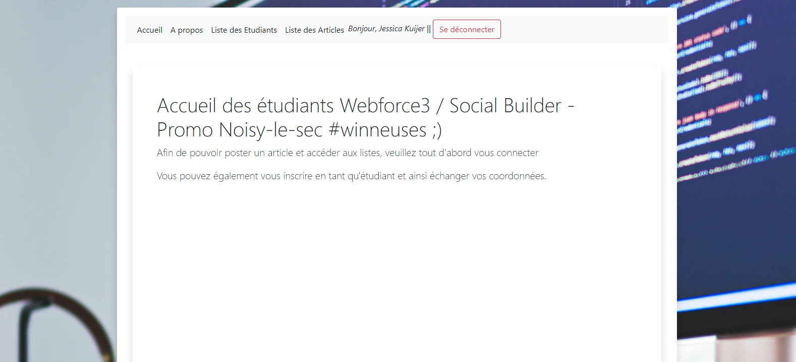

# projet-symfony
Exercice de création de blog, d'une liste étudiants, création d'utilisateurs et intégration d'EasyAdmin avec droits d'accès.

Déroulé:
1/ Il faut installer symfony en premier lieu.
-> create-project symfony/website-skeleton my_project_name

2/ Rajouter Composer
-> commande composer create-project symfony/website-skeleton my_project_name

3/ Ouvrir le serveur Symfony / démarrer Apache et MySQL sur Xampp (ou autre logiciel)
->symfony server:start

4/créer une database et modifier .env
-> configurer le .env avec root à la place de db_user / aucun password (pour Xampp) / et le nom de la base de données à la place de db_name
-> php bin/console d:d:c

5/ pour le style css, rajouter Bootstrap dans base.html.twig

6/ Créer les entités
-> php bin/console m:e et rajouter les properties

7/ Faire le CRUD
-> php bin/console m:crud
Et rajouter le nom de l'entity (modèle de données concerné)

8/ Ne pas oublier de faire des update de la base de données, surtout si on change des données dans l'entity.
-> php bin/console d:s:u --dump-sql (avant, pour vérifier les nouvelles entrées en base / prepare)
-> php bin/console d:s:u --force

-------------------------------------------------------------------------------------------------------------------
9/ Création d'un compte utilisateur
-> php bin/console make:user

10/ Création d'un authentificateur (/login et /logout)
-> php bin/console make:auth
(selectionner 1-login / loginFormAuthenticator / SecurityController / yes)
-> Dans le dossier Security, changer la ligne 99 pour faire une redirection vers la page d'accueil (LoginFormController.php)

11/ Création d'un formulaire d'inscription
->php bin/console make:regis
Cela va créer un controller RegistrationController.php
Faire un update de BDD d:s:u --force

12/ Modifier les getter/setter username puis rajout des "add" dans le template register.
Améliorer le style des formulaires...

-------------------------------------------------------------------------------------------------------------------
13/ Faire une jointure
-> revenir sur php bin/console m:e Article et rajouter property user (u minuscule)
Field type : relation
Donner l'entity User (U majuscule)
Choisir le type de relation ManyToMany, OneToMany, ManyToOne, OneToOne)

14/ Modifier dans le controller (ArticleController), la fonction NEW Article pour la mapper à l'id User
-> $article->setUser($this-getUser());

-------------------------------------------------------------------------------------------------------------------
15/ VichUploaderBundle
se référer a l'installation de la doc symfony
changer les path / rajouter les attributs d'entity
changer le formType et changer les "add"
-> add ('image') devient -> add('imageFile', 'VichImage::class') + son USE
use vich\UploaderBundle\Form\Type\VichImageType;

16/ Créer une entity Commentaire
-> Faire une relation avec l'user (type field) sur entity User
-> plusieurs commentaires par un utilisateur = ManyToOne

-------------------------------------------------------------------------------------------------------------------
17/ Rajouter Fixtures - installation à partir de la doc Symfony
-> Appeler la fonction LOAD
php bin/console d:f:l
Cela va demander de purger la base de données : yes
-> changer l'access control de security.yaml
/!\ un Admin est aussi un User

18/ Rajouter EasyAdmin
pour l'instant (01/07/20), on utilise une version a peu près stable 2.3
-> composer require easycorp/easyadmin-bundle:^2.3
la dernière release s'installait mal.
changement des fichiers .yaml (Easyadmin et security) pour que cela s'affiche correctement avec choix d'option de rôles.
-> accès via localhost:8000/admin

-------------------------------------------------------------------------------------------------------------------
Autres:
Si erreur de type NULL, rajouter des Nullable:YES et ?devant les attributs de get ....
Rajouter des fonctions return __toString dans les entités si toutefois il y a des erreurs de type string.
